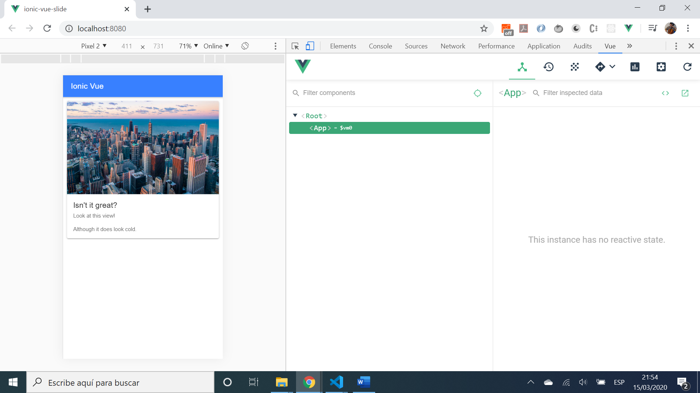

# :zap: Ionic Vue Slide

* App to display an image on a simple Ionic card, using [Vue](https://vuejs.org/) with Ionic from [Ionic/vue](https://www.npmjs.com/package/@ionic/vue) & [@ionic/core](https://www.npmjs.com/package/@ionic/core) npm modules
* From tutorial: [Paul Halliday: Youtube video: Ionic 4 - Angular, React and Vue.js](https://www.youtube.com/watch?v=eQTNqtVeTgE)
* **Note:** to open web links in a new window use: _ctrl+click on link_


## :page_facing_up: Table of contents

* [:zap: Ionic Vue Slide](#zap-ionic-vue-slide)
  * [:page_facing_up: Table of contents](#page_facing_up-table-of-contents)
  * [:books: General info](#books-general-info)
  * [:camera: Screenshots](#camera-screenshots)
  * [:signal_strength: Technologies](#signal_strength-technologies)
  * [:floppy_disk: Setup](#floppy_disk-setup)
  * [:computer: Code Examples](#computer-code-examples)
  * [:cool: Features](#cool-features)
  * [:clipboard: Status & To-do list](#clipboard-status--to-do-list)
  * [:clap: Inspiration](#clap-inspiration)
  * [:file_folder: License](#file_folder-license)
  * [:envelope: Contact](#envelope-contact)

## :books: General info

* Vue app created using Vue CLI then ionic dependencies added

## :camera: Screenshots



## :signal_strength: Technologies

* [Ionic/vue](https://www.npmjs.com/package/@ionic/vue)
* [@ionic/core](https://www.npmjs.com/package/@ionic/core) npm ionic components module
* [Vue v3](https://vuejs.org/)

## :floppy_disk: Setup

* Load dependencies using `npm i`
* To start the server on <http://localhost:8080/> type: 'npm run serve'

## :computer: Code Examples

* Simple ion-card

```html
<ion-card>
  
  <ion-card-header>
    <ion-card-title>Isn't it great?</ion-card-title>
    <ion-card-subtitle>Look at this view!</ion-card-subtitle>
  </ion-card-header>
  <ion-card-content>
    Although it does look cold.
  </ion-card-content>
</ion-card>
```

## :cool: Features

* N/A

## :clipboard: Status & To-do list

* Status: Working.
* To-do: add functionality

## :clap: Inspiration

* [Paul Halliday: Youtube video: Ionic 4 - Angular, React and Vue.js](https://www.youtube.com/watch?v=eQTNqtVeTgE).

## :file_folder: License

* This project is licensed under the terms of the MIT license.

## :envelope: Contact

* Repo created by [ABateman](https://github.com/AndrewJBateman), email: gomezbateman@yahoo.com
